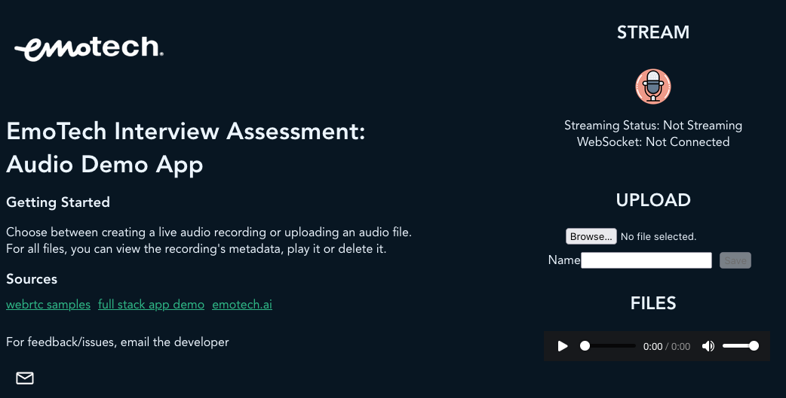

## Emotech Assessment Files Setup

**Frontend: Vue**
**Backend: Java**

Load Docker Images from tar archives



```
docker --input demofrontend.tar
docker --input demobackend.tar
```

Run backend and frontend

```
docker run -p 8080:8080 demobackend
docker run -p 8081:8080 demofrontend
```


